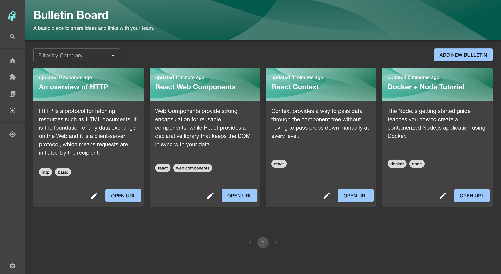
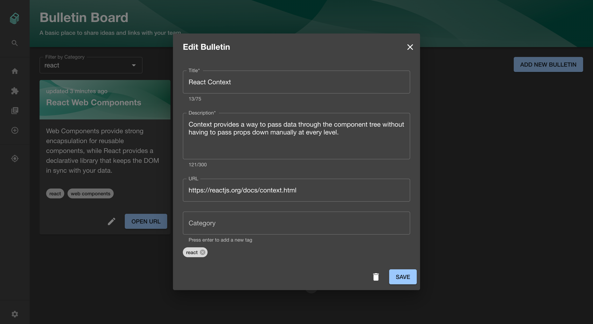

# Bulletin Board Plugin for Backstage

## What is Bulletin Board

Bulletin Board is a Backstage plugin that allows you to share interesting ideas, news and links with your teammates. You can quickly write and edit posts.

#### Plugin's Features

- Homepage displays bulletins by latest update.
- Create, edit and delete bulletins.
- Add tags to categorize bulletins.
- Filter displayed cards by tags.

## Getting Started

You will **need** to install both frontend and backend pluggins:

- Installation instructions for [frontend plugin](./plugins/bulletin-board/README.md)
- Installation instructions for [backend plugin](./plugins/bulletin-board-backend/README.md)

## Screenshots

#### Main Page

#### Add / Edit

